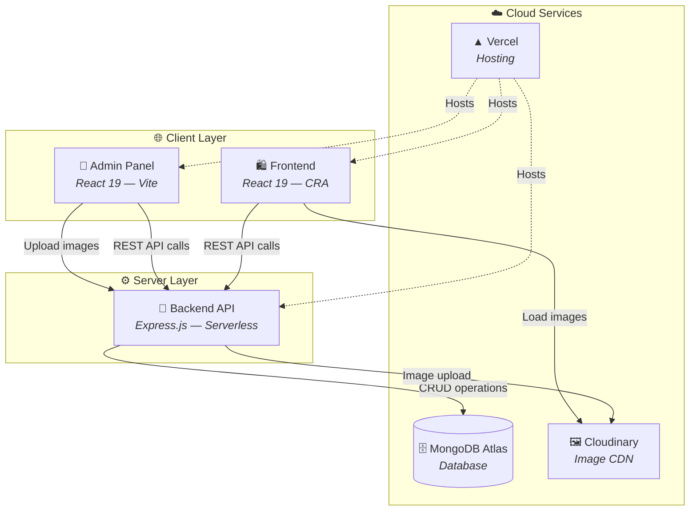
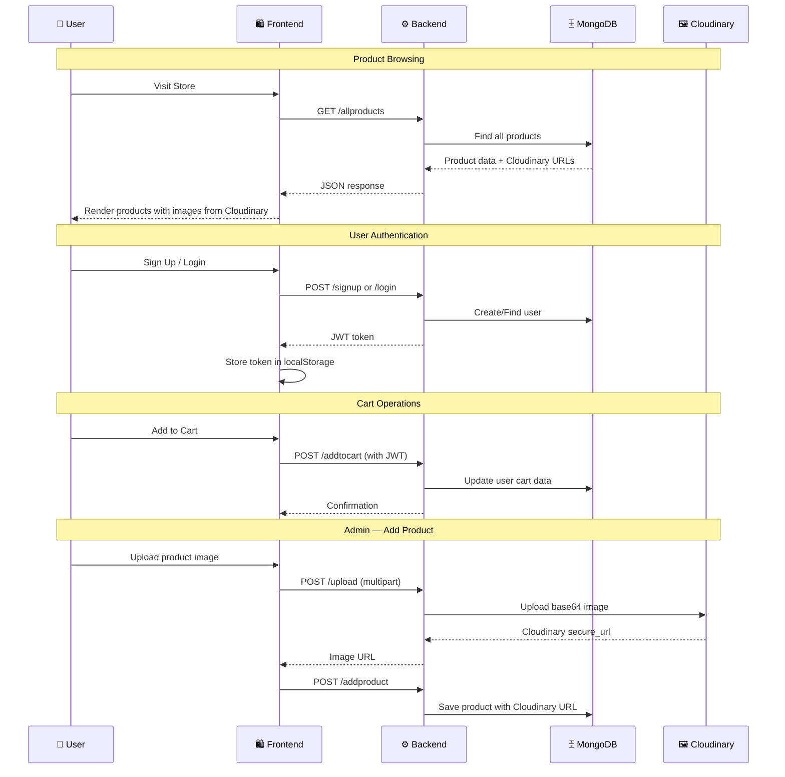
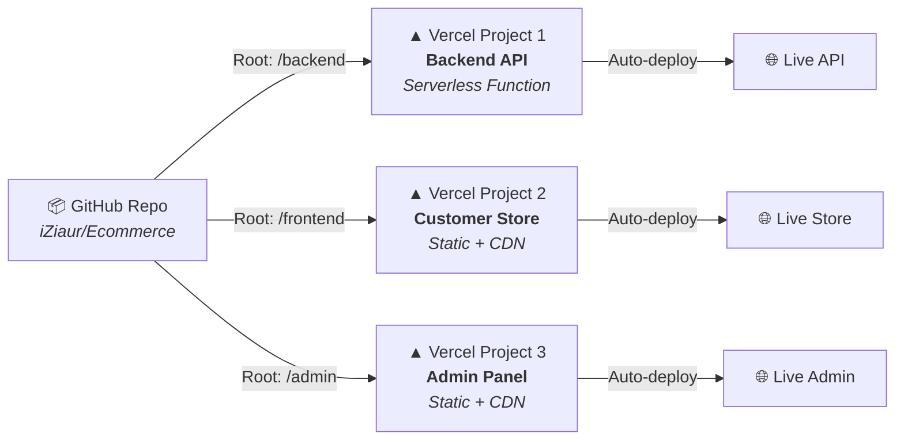
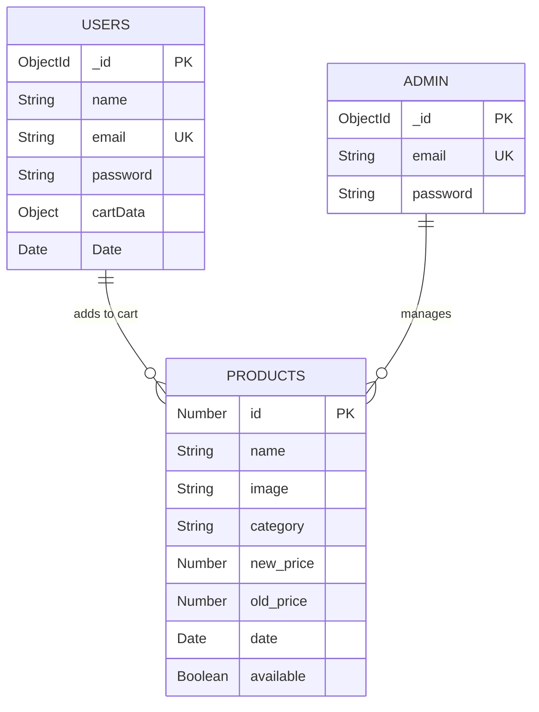

<div align="center">

# 🧵 Threadly — Full-Stack E-Commerce Platform

### A modern, production-ready e-commerce application built with the MERN stack

[](https://react.dev/)
[](https://nodejs.org/)
[](https://www.mongodb.com/)
[](https://vercel.com/)
[](https://cloudinary.com/)

[🌐 Live Store](https://threadly-vert.vercel.app/) · [⚙️ Admin Panel](https://ecommerce-admin-eight-delta.vercel.app/) · [🔌 Backend API](https://ecommercebackend-sand-gamma.vercel.app/)

</div>

---

## 📌 About

**Threadly** is a full-stack e-commerce platform for fashion and apparel. It features a customer-facing storefront, a secure admin dashboard for product management, and a RESTful API backend — all deployed on Vercel with cloud-native image storage via Cloudinary.

Built as a monorepo with three independent applications that communicate through a unified REST API.

---

## ✨ Features

### 🛍️ Customer Storefront
- Browse products by category — **Men**, **Women**, **Kids**
- **Global Search Bar** — Instantly filter and find products by name or category
- Dynamic **Popular in Women** and **New Collections** sections
- Product detail pages with size selection and **Dynamic Context-Aware Descriptions**
- Shopping cart with real-time quantity updates
- **Cart persistence** — cart survives logout/login sessions
- User authentication (Sign Up / Login / Logout) with **Strict 5-Minute Session Timeouts**
- Personalized greeting in navbar ("Hey {name}")
- Beautiful **Flash Notifications (Toasts)** for cart actions and errors
- Fully responsive design — mobile, tablet, desktop

### 🔐 Admin Dashboard
- **Protected by authentication** — separate Admin collection in MongoDB
- **Strict 2-Minute Session Timeouts** for enhanced administrative security
- **Analytics Dashboard** — Track real-time total users and active products
- Add new products with image upload (auto-uploaded to Cloudinary)
- View all products in a sortable list
- Remove products with one click
- Real-time sync with the storefront

### 🔌 Backend API
- RESTful API built with Express.js
- MongoDB Atlas for cloud database
- JWT-based authentication with middleware protection
- **Military-grade Password Security** using `bcrypt` salting and hashing
- Cloudinary integration for serverless-compatible image uploads
- CORS-enabled for cross-origin frontend access

---

## 🏗️ System Architecture



---

## 🔄 Request Flow



---

## 🛠️ Tech Stack

| Layer | Technology | Purpose |
|:---:|:---|:---|
| **Frontend** | React 19, React Router, CSS3 | Customer storefront SPA |
| **Admin** | React 19, Vite, React Router | Admin dashboard SPA |
| **Backend** | Node.js, Express.js | REST API server |
| **Database** | MongoDB Atlas, Mongoose | Cloud NoSQL database |
| **Auth** | JSON Web Tokens (JWT) | Stateless authentication |
| **Images** | Cloudinary, Multer | Cloud image storage & upload |
| **Hosting** | Vercel (Serverless) | Deployment & CI/CD |

---

## 📂 Project Structure

```
Ecommerce/
├── frontend/                  # Customer storefront (CRA)
│   ├── src/
│   │   ├── Components/        # Reusable UI components
│   │   │   ├── Navbar/        # Navigation with auth state
│   │   │   ├── Hero/          # Landing hero section
│   │   │   ├── Popular/       # Popular products section
│   │   │   ├── NewCollections/ # Latest products section
│   │   │   ├── ProductDisplay/ # Product detail view
│   │   │   ├── CartItems/     # Shopping cart
│   │   │   ├── Footer/        # Site footer
│   │   │   └── ...
│   │   ├── Pages/             # Route pages
│   │   │   ├── Shop.jsx       # Homepage
│   │   │   ├── ShopCategory.jsx # Category filter page
│   │   │   ├── Product.jsx    # Product detail page
│   │   │   ├── LoginSignUp.jsx # Auth page
│   │   │   └── Cart.jsx       # Cart page
│   │   └── Context/
│   │       └── ShopContext.jsx # Global state (products, cart)
│   └── package.json
│
├── admin/                     # Admin dashboard (Vite)
│   ├── src/
│   │   ├── Components/
│   │   │   ├── Login/         # Admin authentication
│   │   │   ├── AddProduct/    # Product creation form
│   │   │   ├── ListProduct/   # Product management list
│   │   │   ├── Sidebar/       # Navigation sidebar
│   │   │   └── Navbar/        # Admin navbar
│   │   └── Pages/
│   │       └── Admin/         # Main admin layout
│   └── package.json
│
├── backend/                   # REST API (Express.js)
│   ├── index.js               # Server, routes, models
│   ├── vercel.json            # Vercel serverless config
│   └── package.json
│
└── README.md
```

---

## 🔌 API Reference

### Public Endpoints

| Method | Endpoint | Description |
|:---:|:---|:---|
| `GET` | `/` | Health check |
| `GET` | `/allproducts` | Get all products |
| `GET` | `/newcollections` | Get 8 newest products |
| `GET` | `/popularinwomen` | Get 4 popular women's products |
| `POST` | `/signup` | Register a new user |
| `POST` | `/login` | Authenticate user |
| `POST` | `/adminlogin` | Authenticate admin |

### Protected Endpoints (requires `auth-token` header)

| Method | Endpoint | Description |
|:---:|:---|:---|
| `POST` | `/addtocart` | Add item to user's cart |
| `POST` | `/removefromcart` | Remove item from cart |
| `POST` | `/getcart` | Get user's saved cart |
| `POST` | `/getuser` | Get authenticated user's name |

### Admin Endpoints

| Method | Endpoint | Description |
|:---:|:---|:---|
| `POST` | `/upload` | Upload product image to Cloudinary |
| `POST` | `/addproduct` | Create a new product |
| `POST` | `/removeproduct` | Delete a product |

---

## 🚀 Getting Started

### Prerequisites

- **Node.js** v18+
- **MongoDB Atlas** account ([mongodb.com](https://www.mongodb.com/atlas))
- **Cloudinary** account ([cloudinary.com](https://cloudinary.com/))

### 1. Clone the repository

```bash
git clone https://github.com/iZiaur/Ecommerce.git
cd Ecommerce
```

### 2. Setup Backend

```bash
cd backend
npm install
```

Create a `.env` file:

```env
MONGO_USERNAME=your_mongo_username
MONGO_PASSWORD=your_mongo_password
CLOUDINARY_CLOUD_NAME=your_cloud_name
CLOUDINARY_API_KEY=your_api_key
CLOUDINARY_API_SECRET=your_api_secret
JWT_SECRET=your_jwt_secret
```

Start the server:

```bash
node index.js
```

> Backend runs at `http://localhost:4000`

### 3. Setup Frontend

```bash
cd frontend
npm install
```

Create a `.env` file:

```env
REACT_APP_BACKEND_URL=http://localhost:4000
```

Start the dev server:

```bash
npm start
```

> Frontend runs at `http://localhost:3000`

### 4. Setup Admin Panel

```bash
cd admin
npm install
```

Create a `.env` file:

```env
VITE_BACKEND_URL=http://localhost:4000
```

Start the dev server:

```bash
npm run dev
```

> Admin runs at `http://localhost:5173`

---

## ☁️ Deployment

This project is deployed as **3 separate Vercel projects** from the same monorepo:

| App | Root Directory | Framework | Live URL |
|:---|:---:|:---:|:---|
| Backend | `backend` | Other | [ecommercebackend-sand-gamma.vercel.app](https://ecommercebackend-sand-gamma.vercel.app/) |
| Frontend | `frontend` | Create React App | [threadly-vert.vercel.app](https://threadly-vert.vercel.app/) |
| Admin | `admin` | Vite | [ecommerce-admin-eight-delta.vercel.app](https://ecommerce-admin-eight-delta.vercel.app/) |

### Deployment Architecture



> Every push to `main` triggers auto-deployment across all three projects.

---

## 🔐 Environment Variables

### Backend (Vercel)

| Variable | Description |
|:---|:---|
| `MONGO_USERNAME` | MongoDB Atlas username |
| `MONGO_PASSWORD` | MongoDB Atlas password |
| `JWT_SECRET` | Secret key for JWT signing |
| `CLOUDINARY_CLOUD_NAME` | Cloudinary cloud name |
| `CLOUDINARY_API_KEY` | Cloudinary API key |
| `CLOUDINARY_API_SECRET` | Cloudinary API secret |

### Frontend (Vercel)

| Variable | Description |
|:---|:---|
| `REACT_APP_BACKEND_URL` | Backend API URL |
| `CI` | Set to `false` for CRA builds |

### Admin (Vercel)

| Variable | Description |
|:---|:---|
| `VITE_BACKEND_URL` | Backend API URL |

---

## 📊 Database Schema



---

## 🤝 Contributing

Contributions are welcome! Feel free to open issues and pull requests.

1. Fork the repository
2. Create your feature branch (`git checkout -b feature/amazing-feature`)
3. Commit your changes (`git commit -m 'add amazing feature'`)
4. Push to the branch (`git push origin feature/amazing-feature`)
5. Open a Pull Request

---

## 📄 License

This project is open source and available under the [MIT License](LICENSE).

---

<div align="center">

**Built with ❤️ by [Ziaur Rahman](https://github.com/iZiaur)**

⭐ Star this repo if you found it helpful!

</div>
